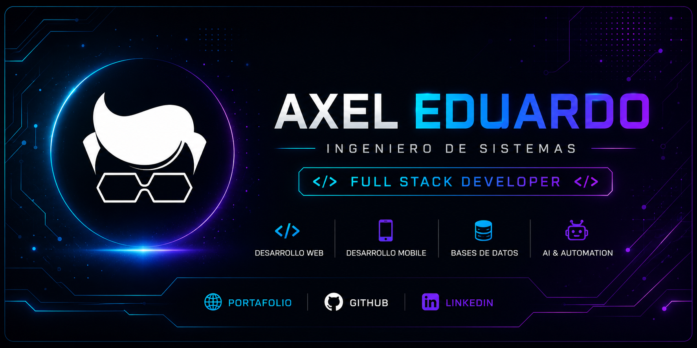

<div align="center">



<br>

<a href="https://axeledu.netlify.app/">
  
</a>
&nbsp;
<a href="https://github.com/AxelEduem">
  
</a>

</div>

<br>

<div align="center">


</div>

---

## 👨‍💻 Sobre mí

Soy **Axel Eduardo Escribano Meza**, Ingeniero de Sistemas y **Full Stack Developer**.

Me apasiona transformar ideas y necesidades en soluciones de software **funcionales, modernas y escalables**.

Trabajo principalmente en desarrollo web, aplicaciones móviles, APIs, bases de datos y automatización, combinando diferentes tecnologías para construir soluciones completas.

<div align="center">


</div>

<br>

<div align="center">

> 💡 **Las ideas son el comienzo. La tecnología es el medio. Crear soluciones es el objetivo.**

</div>

---

## ⚡ Mi Stack

### 💻 Lenguajes

<div align="center">


</div>

### 🎨 Frontend

<div align="center">


</div>

### ⚙️ Backend & Frameworks

<div align="center">


</div>

### 📱 Mobile

<div align="center">


</div>

### 🗄️ Bases de datos

<div align="center">


<br><br>


</div>

### 🛠️ DevOps & Herramientas

<div align="center">


</div>

### 🔐 APIs & Autenticación

<div align="center">


</div>

---

<div align="center">


</div>

## 🚀 Áreas de especialización

<table align="center">
<tr>
<td align="center" width="50%">

### 💻 Full Stack

Desarrollo de aplicaciones web modernas, funcionales y escalables.

</td>

<td align="center" width="50%">

### ⚙️ Backend

APIs, servicios, lógica de negocio y arquitecturas backend.

</td>
</tr>

<tr>
<td align="center" width="50%">

### 📱 Mobile

Aplicaciones multiplataforma utilizando Flutter.

</td>

<td align="center" width="50%">

### 🤖 AI & Automation

Integración de servicios inteligentes y automatización de procesos.

</td>
</tr>

<tr>
<td align="center" width="50%">

### 🗄️ Databases

Diseño, integración y gestión de bases de datos.

</td>

<td align="center" width="50%">

### 🔐 APIs & Security

APIs REST, autenticación y autorización mediante JWT.

</td>
</tr>
</table>

---

## 🧠 Tecnologías que utilizo

<div align="center">

```text
Frontend        → React · Vue · HTML5 · CSS3
Backend         → Node.js · Spring Boot · Django · Laravel
Mobile          → Flutter
Languages       → Java · JavaScript · TypeScript · Python · PHP · Dart
Databases       → MySQL · PostgreSQL · SQL Server · Redis
DevOps          → Git · Docker · Linux · Nginx
Tools           → GitHub · Postman
APIs            → REST API · JWT
```

</div>

---

## 💡 Mi filosofía

<div align="center">


<br><br>

**💻 Construir**    **⚡ Aprender**    **🚀 Evolucionar**

</div>

---

## 🌐 Conecta conmigo

<div align="center">

<a href="https://axeledu.netlify.app/">

</a>

 

<a href="https://github.com/AxelEduem">

</a>

</div>

<br>

<div align="center">


<br><br>

### 🚀 Gracias por visitar mi perfil.

</div>

<br>

<div align="center">


</div>
